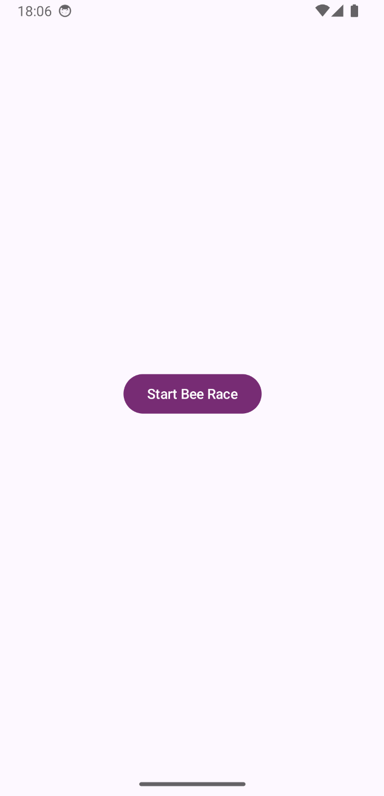
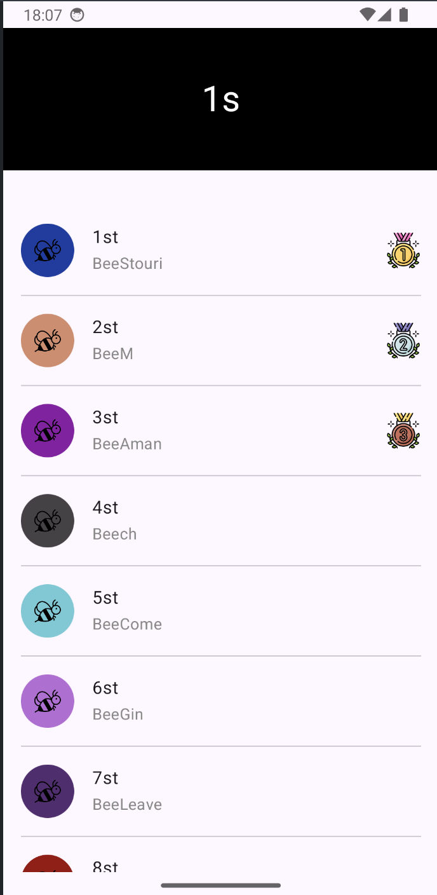
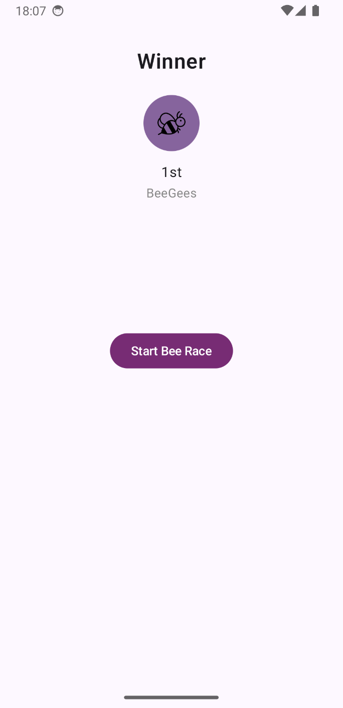

# Bee Race App

Android app simulating a Bee race: showing a list of Bees and their position in a rac.
The project is estructured with Hexagonal Architecture, MVVM, Jetpack Compose, Retrofit, Multi module and more.

* * *

* ## What are the key concepts of this project:
  * Hexagonal Architecture
  * Jetpack Compose
  * Multi Module project
  * Jetpack Compose Navigation
  * ViewModel

* ## What libraries has been used:
  * Retrofit - Interface and client to the API, has a good integration with Kotlin Coroutines
  * OkHttp - To give support to Retrofit
  * Gson - Converts JSON to objects and objects to JSON
  * Jetpack ViewModel - To support reactive states
  * Kotlin Coroutines - To make asynchronous calls
  * Dagger/Hilt - Dependency injection

* * *
* ## Why Hexagonal Architecture?
    * To create a flow of dependencies pointing to inwards (from Modules to the Domain). So our domain is free from dependencies and we can focus on business logic without worrying about Android technical stuff.
      

* ## Demonstration
*  
*  
*  

* * *
* ## Email
* E-mail: matheusfelipecorreaalves@gmail.com
